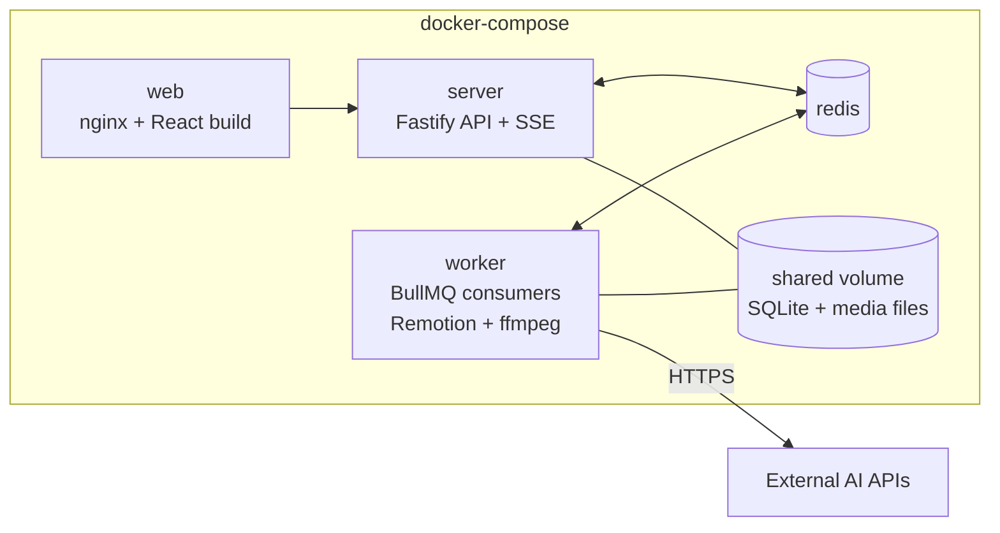

<div align="center">

# XYZ Studio

**Turn any idea into a publish-ready video — in minutes.**

Idea → Transcript → Scene-by-scene clips + voice → Assembled video + publishing metadata

[](https://www.typescriptlang.org/)
[](https://react.dev/)
[](https://fastify.dev/)
[](https://bullmq.io/)
[](LICENSE)
[](https://github.com/IridiumAI/XYZStudio/actions)

</div>

---

## What is XYZ Studio?

XYZ Studio is an **interactive, AI-powered video creation platform**. You describe an idea; the system collaboratively builds a structured transcript with you, routes each scene to the right rendering path based on your budget, generates clips and narration in parallel, then assembles everything into a final video with platform-ready publishing metadata.

The creation workflow is deeply interactive — edit the transcript directly, give natural-language feedback to revise it, and review per-scene clips individually before assembly. The output is a standard video file.

```
you: "Explain how garbage collection works, cartoon style, 16:9, $20 budget"
      ↓
  Streaming transcript (scenes, narration, visual notes)
      ↓
  Edit / revise with LLM chat  →  approve
      ↓
  Per-scene jobs: Remotion diagrams + gen-video character scenes + ElevenLabs voice (parallel)
      ↓
  Scene review gate — approve or regenerate per scene
      ↓
  ffmpeg assembly  →  final .mp4 + YouTube/TikTok metadata
```

---

## Features

- **Budget-aware rendering** — a $1–$200 slider routes each scene between free programmatic Remotion rendering and paid generative video, spending your budget on the scenes that benefit most
- **Streaming transcript editor** — LLM output streams directly into a scene table; direct cell editing and natural-language revision chat; full version history
- **Visual consistency** — a style bible (style prompt + character sheets) is generated once per session and injected into every image/video call
- **Async by design** — close the tab, come back later; job progress pushed over SSE and queryable via polling
- **Bilingual** — English and Mandarin Chinese (Simplified) per session, including localized on-screen text, voice presets, and metadata
- **Multi-user** — allowlist-gated signup, every session and asset scoped to its owner
- **YouTube chapters** — auto-generated from scene timestamps, formatted into the description

---

## Architecture



| Layer | Technology |
|---|---|
| Frontend | React 18, Vite, TanStack Query, Zustand |
| Backend | Node.js, Fastify, REST + SSE |
| Auth | better-auth — email/password, allowlist-gated |
| Job queue | BullMQ on Redis |
| Database | SQLite via Drizzle ORM (Postgres-compatible) |
| File storage | Local disk behind a `StorageProvider` interface |
| Text generation | Anthropic Claude (`claude-opus-4-8`) |
| Image generation | OpenAI `gpt-image-1` |
| Video generation | Google Veo 3 (via Gemini API) |
| Programmatic rendering | Remotion |
| Video assembly | ffmpeg |
| Voice / TTS | ElevenLabs (multilingual) |
| Monorepo | pnpm workspaces |

---

## Monorepo Layout

```
apps/
  server/       Fastify API + BullMQ worker (TypeScript, Drizzle/SQLite, better-auth)
  web/          React + Vite frontend
packages/
  shared/       Zod schemas, cost model, provider interfaces
docs/
  initial_design/   High-level design doc (architecture, data model, decision log)
```

---

## Quick Start

### Prerequisites

- Node.js ≥ 22
- pnpm ≥ 11 (`corepack enable pnpm`)
- Docker (for Redis; or point `REDIS_URL` at an existing instance)

### 1 — Install

```sh
corepack enable pnpm
pnpm install
```

### 2 — Configure

```sh
cp .env.example .env
```

Open `.env` and fill in at minimum:

| Variable | Description |
|---|---|
| `ANTHROPIC_API_KEY` | Required for transcript generation (Phase 1) |
| `AUTH_SECRET` | Session signing key — generate with `openssl rand -base64 32` |
| `ALLOWLIST_EMAILS` | Comma-separated emails permitted to sign up |

See [`.env.example`](.env.example) and the [full environment reference](#environment-variables) below for all variables.

### 3 — Start Redis and apply the schema

```sh
docker compose up -d redis
pnpm db:push
```

### 4 — Run

```sh
pnpm dev
```

- Web: http://localhost:5173
- API: http://localhost:3000

Sign up with an email from `ALLOWLIST_EMAILS`, create a session, and start generating.

---

## Environment Variables

| Variable | Provider | Required | Notes |
|---|---|---|---|
| `ANTHROPIC_API_KEY` | Anthropic Claude | Phase 1 | All text generation |
| `OPENAI_API_KEY` | OpenAI | Phase 2 | Sketches, keyframes, character sheets |
| `GEMINI_API_KEY` | Google Gemini → Veo | Phase 2 | Generative video (paid plan required) |
| `ELEVENLABS_API_KEY` | ElevenLabs | Phase 2 | Narration TTS |
| `FAL_KEY` | fal.ai | Optional | FLUX image / Kling video fallback adapters |
| `RUNWAY_API_KEY` | Runway | Optional | Gen-4 video fallback adapter |
| `AUTH_SECRET` | — | Always | `openssl rand -base64 32` |
| `ALLOWLIST_EMAILS` | — | Always | Comma-separated seed list for signup |
| `BUDGET_SAFETY_CEILING_MULTIPLIER` | — | No | Hard-stop multiplier (default `1.5`) |
| `REDIS_URL` | — | No | Default: `redis://localhost:6379` |
| `DATABASE_URL` | — | No | Default: `data/db.sqlite` |
| `STORAGE_ROOT` | — | No | Default: `data/` |
| `PORT` | — | No | Default: `3000` |
| `WEB_ORIGIN` | — | No | Default: `http://localhost:5173` |

---

## Testing

```sh
pnpm test        # unit tests — no API keys or Redis needed
pnpm typecheck   # TypeScript across all packages
```

| Level | Tooling | What's covered |
|---|---|---|
| Unit | Vitest | Schema validation, cost estimator, budget router, prompt builders, timestamp math |
| Integration | Vitest + in-memory SQLite + Testcontainers Redis | Full pipeline with mock providers; auth scoping, budget ledger, job retry |
| E2E | Playwright against docker-compose | Sign up → create session → transcript → approve → scene review → assembly |

---

## Full Stack via Docker

```sh
docker compose --profile full up --build
```

- Web: http://localhost:8080
- API: http://localhost:3000

The `worker` service can be scaled independently:

```sh
docker compose --profile full up --build --scale worker=4
```

---

## Roadmap

### Phase 1 — Transcript loop ✅
- Auth (allowlist-gated email/password)
- Session creation (style, language, aspect ratio, budget, voice)
- Streaming transcript generation + revision chat with version history
- Live cost estimate vs. budget

### Phase 2 — Asset generation pipeline
- Style bible + character sheet generation
- Approve → cost plan confirmation → parallel per-scene jobs (Remotion / gen-video / TTS)
- Job dashboard with per-scene progress and retry-failed-only
- Scene review gate with best-of-N candidate picker for high-budget scenes

### Phase 3 — Assembly & publishing
- ffmpeg assembly: clip concat, narration mux, subtitles, thumbnail
- Platform metadata: title, description, YouTube chapter list, hashtags
- Background-session UX: close tab, return later; in-app completion notification

---

## Design Documentation

The full high-level design — including the data model, provider choices, budget routing algorithm, async job design, and decision log — lives in [`docs/initial_design/proposed_high_level_design.md`](docs/initial_design/proposed_high_level_design.md).

---

## Contributing

1. Fork and create a branch from `main`
2. Run `pnpm install && pnpm typecheck && pnpm test` — all must pass
3. Open a pull request with a clear description of the change

---

## License

MIT © 2026 IridiumAI — see [LICENSE](LICENSE).
