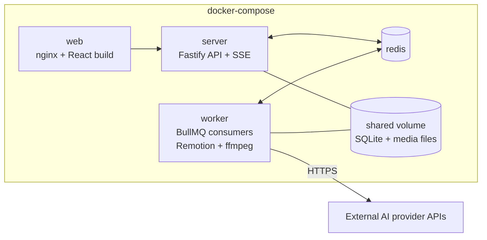
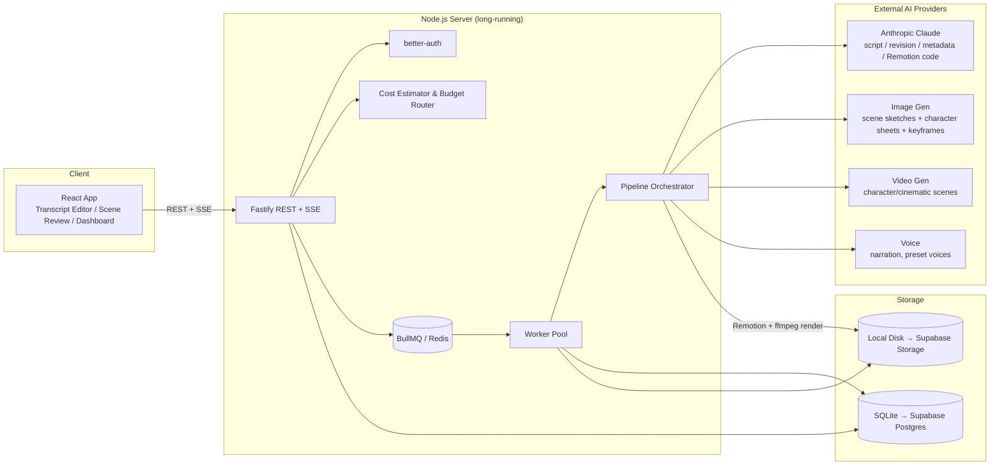
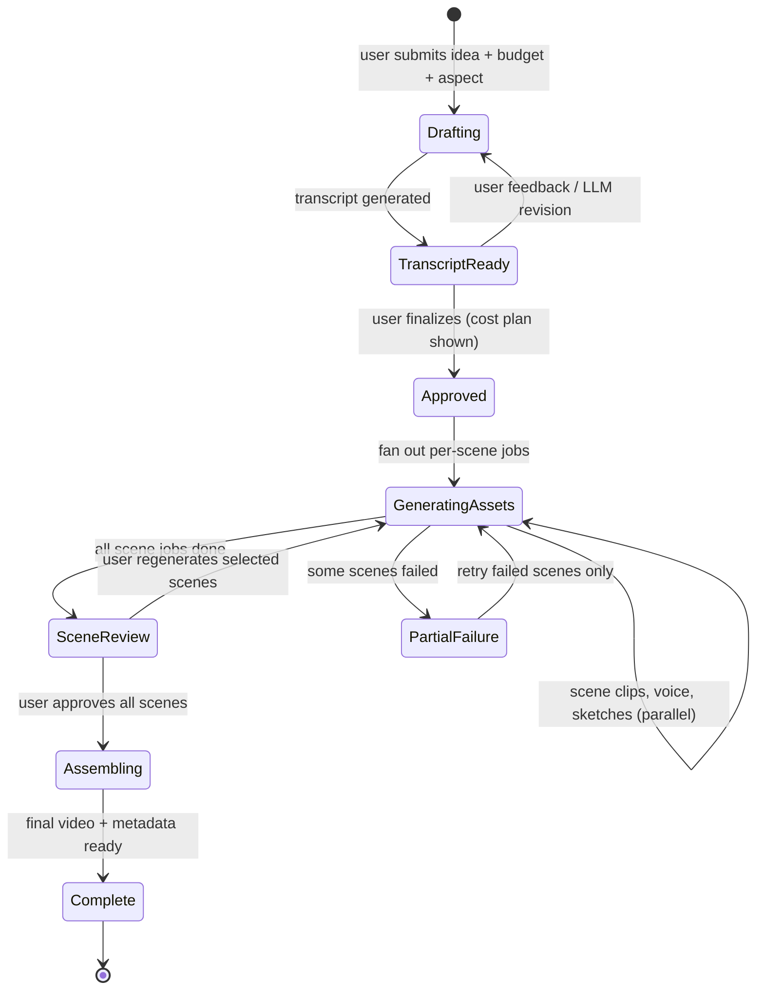
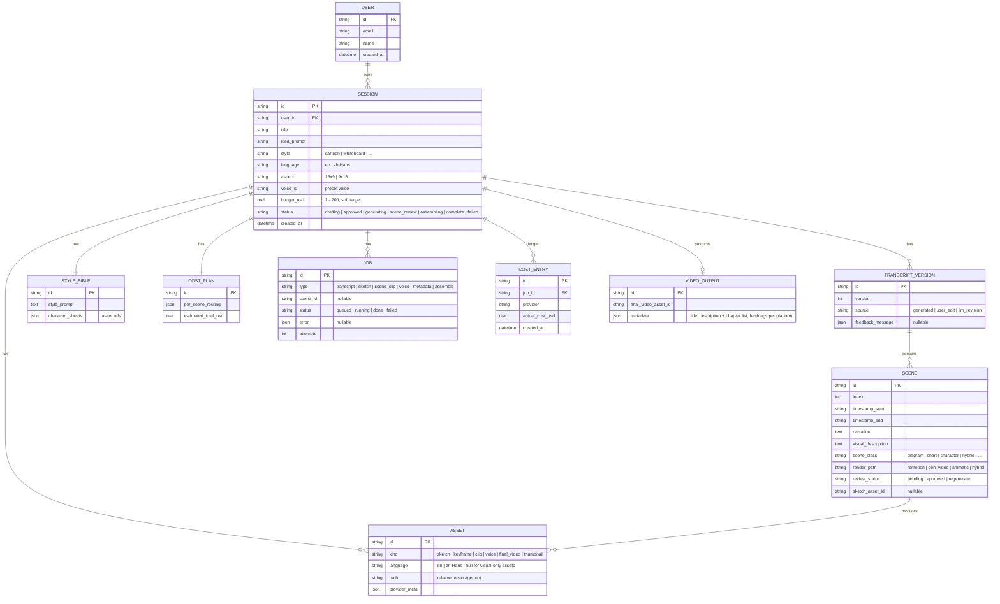

# XYZ Studio — Proposed High-Level Design

> Status: **v4 — finalized 2026-06-12** after three rounds of author decisions (see §11 Decision Log).
> No blocking questions remain — ready for project scaffolding.

## 1. Product Summary

XYZ Studio turns a one-line (or very detailed) idea into a publish-ready video:

1. **Idea → Transcript.** User submits an idea, a style choice, a language (**English or Mandarin Chinese**), an aspect ratio (16:9 @ 1080p or 9:16), and a **per-video budget ($1–$200 slider, soft target)**. The system generates a structured transcript: timestamped scenes, narration text, on-screen scene/animation descriptions, and optional scene sketches.
2. **Revise.** User edits the transcript directly or gives natural-language feedback to the LLM, iterating until the transcript is approved.
3. **Transcript → Assets.** The system generates per-scene video clips and narration voice-over, routing scenes between cheap programmatic rendering and generative video **based on the budget**.
4. **Review gate.** User reviews per-scene clips and can regenerate individual scenes **before** final assembly.
5. **Assemble & package.** Final video is assembled, plus publishing metadata (title, description **including a YouTube chapter list derived from scene timestamps**, hashtags per platform).
6. **Async by design.** Generation jobs run in the background on a long-running server; the user can close the tab and check back later. Multi-user from day one.

Core differentiator to protect in the design: **visual consistency** — one style and one set of characters held constant across all scenes of a video.

> "Interactive" scope (decided): interactivity lives in the **creation workflow** (editing, feedback, scene review). Output videos are standard videos; clickable YouTube chapters come free via description timestamps (first chapter `0:00`, ≥3 chapters, each ≥10s — auto-rendered by YouTube as progress-bar chapters).

---

## 2. Tech Stack

| Layer | Choice | Rationale |
|---|---|---|
| Language | TypeScript everywhere | Single language across frontend, backend, shared types. |
| Frontend | **React 18 + Vite** | Decided (Q1). |
| UI state/data | TanStack Query + Zustand | Server-state caching for job polling; light client state. |
| Backend | **Node.js + Fastify** | Long-running server, first-class TypeScript, good streaming (SSE) support. |
| API style | REST + **Server-Sent Events** | REST for CRUD; SSE for streaming LLM output and job progress. |
| Auth | **better-auth** — email/password, **allowlist-gated signup** | TypeScript-native, Drizzle adapter, works on SQLite *and* Postgres — survives the Supabase migration. Multi-user decided (Q6); registration restricted to an admin-managed allowlist (decision E). Social login deferred. |
| Job queue | **BullMQ on Redis** | Decided (Q9): Redis is acceptable; runs as its own container in docker-compose. Per-scene jobs, retries, parallelism, rate limiting. |
| Database | **SQLite via Drizzle ORM** | Drizzle targets both SQLite and Postgres, making the planned Supabase migration mostly a dialect change. All queries behind a repository layer; no SQLite-only SQL. |
| File storage | Local disk behind a `StorageProvider` interface | `data/users/<userId>/sessions/<sessionId>/...`; interface lets us swap in Supabase Storage/S3 later. |
| Media processing | **ffmpeg** (via `fluent-ffmpeg`) | Clip concatenation, audio muxing, subtitles, thumbnails. |
| Programmatic animation | **Remotion** | React-based video rendering — the cheap rendering path for diagram/chart/whiteboard scenes (§4.2). |
| Validation | Zod | Shared schemas between API, DB layer, and LLM structured outputs. |
| Monorepo | pnpm workspaces (`apps/web`, `apps/server`, `packages/shared`) | Shared types (transcript schema, job states, cost model) used by both ends. |
| Deployment | **Docker Compose** | Containers: `web` (static build behind server or nginx), `server` (API), `worker` (queue consumers + Remotion/ffmpeg), `redis`. SQLite DB + media on a shared volume. |

---

## 3. Architecture

### Pipeline lifecycle (with scene-review gate)

Each scene is an independent job: failures retry at scene granularity, scenes generate in parallel within provider rate limits, and the user can regenerate any single scene from the review screen. Regeneration cost is checked against the remaining budget before the job is enqueued (§4.4).

---

## 4. Model & Provider Choices

### 4.1 Text — Anthropic Claude (verified current, 2026-06)

All text generation goes through the Anthropic TypeScript SDK (`@anthropic-ai/sdk`), streaming by default, with **adaptive thinking** (`thinking: {type: "adaptive"}`) for the heavyweight tasks.

| Task | Model | Why |
|---|---|---|
| Transcript generation (idea → full structured script) | `claude-opus-4-8` ($5/$25 per MTok) | The product's quality ceiling lives here: narrative quality, pacing, humor, hooks. Structured outputs (`output_config.format` with Zod via `zodOutputFormat`) so the transcript is always valid against the scene schema. Stream tokens to the editor over SSE. |
| Revision chat (user feedback → revised transcript) | `claude-opus-4-8` | Same model keeps voice/quality consistent; prompt caching on the conversation prefix (~90% input cost reduction on iterative edits). |
| Budget routing plan (scene → rendering path, given budget) | `claude-opus-4-8` | Sees the whole transcript + cost table; outputs a routing plan (§4.4). |
| Remotion/animation code generation | `claude-opus-4-8`, `effort: "xhigh"` | Agentic coding — recommended setting for code generation. |
| Title / description / chapters / hashtags | `claude-opus-4-8`, `effort: "low"` | Cheap relative to the pipeline; one model everywhere simplifies prompt maintenance. `claude-haiku-4-5` ($1/$5) is the downgrade candidate if volume ever warrants it. |

Cost intuition: a 5-minute transcript is roughly 3–6K output tokens plus revisions — well under $1 of LLM spend per video. Text is **not** the dominant cost; video generation is.

### 4.2 Visuals — split scene types

Generative video models are excellent at characters and cinematic motion but **bad at exactly what this product needs most**: legible text, accurate charts, animated diagrams, and consistent recurring characters. The transcript schema classifies every scene, and each class takes a different rendering path:

| Scene class | Examples | Rendering path | Marginal cost |
|---|---|---|---|
| `diagram` / `chart` / `text` | architecture diagrams, graphs, bullet reveals, whiteboard explainers | **Remotion code generated by Claude** → deterministic, legible, re-renderable after edits. Whiteboard style = SVG stroke-draw animation of generated line art. | ~free (compute only) |
| `character` / `cinematic` | cartoon host talking, scene-setting b-roll, sight gags | **Generative video model** from a style-locked keyframe image (image→video keeps style control). | $$ — the dominant cost |
| `hybrid` | character pointing at a chart | Remotion composition layering a generated character clip/still over programmatic graphics. | $ |

**Style consistency mechanism:** at session creation, generate a **style bible** — a fixed style prompt block plus 1–N **character sheets** (reference images). Every image/video generation call for the session injects the style block and character references. Stored with the session so regeneration months later still matches.

### 4.3 Image, Video, Voice providers (⚠️ verify pricing/availability at implementation time)

Recommendations as of knowledge cutoff (Jan 2026); each sits behind a provider interface so swapping is cheap. **These are the accounts/keys needed — see §9 for the environment file.**

| Capability | Primary | Alternatives (optional adapters) | Notes |
|---|---|---|---|
| Image gen (sketches, keyframes, character sheets) | **OpenAI `gpt-image-1`** | FLUX via fal.ai (LoRA for locked character identity), Google Imagen | ~$0.02–0.10/image. |
| Video gen (character/cinematic scenes) | **Google Veo 3.x** (via Gemini API) | Runway Gen-4, OpenAI Sora 2, Kling via fal.ai | Image→video from style-locked keyframes. Roughly $0.10–0.50+/generated second; clips 4–10s, so scene planning respects clip-length limits. Supports both 16:9 and 9:16. |
| Voice / TTS | **ElevenLabs** (multilingual model) | OpenAI TTS (cheaper fallback) | ~$0.10–0.30 per 5-min narration. Per-word timestamps sync scene boundaries to actual narration timing. **Preset voice list** curated per language — separate English and Mandarin voice sets — selectable per session; `VoiceProvider` interface designed so voice cloning later is just another voice source. |

**Provider abstraction:** `TextProvider`, `ImageProvider`, `VideoProvider`, `VoiceProvider` interfaces in `packages/shared`, one adapter per vendor, config-driven selection.

### 4.4 Budget-aware routing ($1–$200 slider)

The budget slider is the user's quality/cost dial. Design:

1. **Pricing table** (`packages/shared/cost-model.ts`, config-driven): per-unit costs for each provider operation — $/image, $/video-second by provider+tier, $/TTS-character, rough LLM cost. Updated as providers change pricing.
2. **Cost estimator**: pure function `(transcript, styleBible, budget) → CostPlan`. Runs on every transcript version; the editor always shows *estimated cost vs. budget* live.
3. **Routing planner**: given the budget, decide per-scene rendering:
   - **Floor (~$1–5):** everything renders via Remotion (+ still images animated with pans/zooms — "animatic" mode); voice always real TTS (it's cheap and quality-critical).
   - **Mid:** Claude ranks scenes by *gen-video benefit* (hook scenes, character moments, punchlines rank high; diagrams rank low — they're better in Remotion anyway). Gen-video budget is spent down the ranked list until exhausted; the rest renders via Remotion/stills.
   - **High (~$100–200):** all character/cinematic scenes get gen-video, higher-tier models/resolutions, and **best-of-N candidate generations per scene** (N derived from remaining budget), with the pick made in the scene-review gate. *(Decision F: in Phase 2.)*
4. **Budget ledger**: every provider call records actual cost against the session. The budget is a **soft target, not a hard cap** (decision B): the routing plan aims at it, the UI shows estimated + actual spend against it, and regenerations or candidate picks that push past it proceed with a visible overrun warning ("this puts the session ~$X over budget") rather than being blocked.
5. **Safety ceiling** (decision G): an absolute per-session ceiling of `budget × BUDGET_SAFETY_CEILING_MULTIPLIER` (default 1.5×, env-configurable) protects against runaway spend (stuck retry loops, mis-priced providers). Unlike the soft budget, the ceiling **is** enforced: workers stop enqueuing new provider calls once reached, and the session surfaces a "ceiling reached" state with the option to raise the budget.
5. The cost plan is shown at the Approve step — the user sees exactly which scenes get which treatment before money is spent.

### 4.5 Output formats

Per-session choice (decided, Q4):

| Aspect | Resolution | Target platforms |
|---|---|---|
| 16:9 | 1920×1080 | YouTube |
| 9:16 | 1080×1920 | TikTok, Shorts, Reels |

One aspect per session. Aspect flows into the transcript prompt (composition guidance differs for vertical), Remotion composition size, image/video generation parameters, and ffmpeg assembly.

### 4.6 Language (English / Mandarin Chinese — Simplified)

Per-session choice (decision D), flowing through the whole pipeline. Mandarin uses **Simplified characters** (decision J).

- **Transcript + revision chat + metadata** generated in the session language (Claude handles both natively); hashtags/platform metadata localized accordingly. For zh videos, the description additionally includes an English title translation for discoverability (default assumption — easy to drop).
- **Voice presets** filtered to the session language (ElevenLabs multilingual model; curated zh voice set alongside the en set).
- **On-screen text in Remotion scenes** rendered in the session language — the worker image bundles a CJK font (Noto Sans CJK SC) so Simplified Chinese renders correctly in diagrams, charts, and subtitles.
- One language per session for v1, but **language-dependent assets (voice, on-screen-text renders, metadata) are language-tagged from day one** (decision I), so a future "same video in the other language" feature can reuse all visual assets and regenerate only narration/text. Visual-only assets (keyframes, character sheets) carry a null language tag.

---

## 5. Data Model (SQLite → Postgres-compatible)

Key points:

- **Multi-user:** `USER` table managed by better-auth; every session is user-owned; all API routes scoped by authenticated user. Files under `data/users/<userId>/sessions/<sessionId>/...`.
- **Transcript versions are immutable** — every generation, user edit, or LLM revision appends a version. Cheap undo, full audit, clean diffing.
- **Scenes carry `scene_class` + `render_path` + `review_status`** — class assigned by the LLM (user-overridable), render path assigned by the budget router, review status driven by the scene-review gate.
- **Cost ledger** (`COST_ENTRY`) records actuals per provider call; powers the budget hard cap and per-user spend reporting.
- DB stores relative paths only, so a storage-backend migration doesn't touch the schema.

---

## 6. Key Features (build order)

**Phase 1 — Transcript loop (the product's core feedback loop)**
1. Auth (better-auth: email/password, signup gated by an allowlist — seeded from `ALLOWLIST_EMAILS`, extended via direct DB edits; no admin UI (decision H)).
2. Session creation: idea prompt + style picker + language (en/zh) + aspect (16:9/9:16) + budget slider + preset voice picker (filtered by language).
3. Streaming transcript generation into a scene-table editor; live cost estimate vs. budget.
4. Direct cell editing + "revise with feedback" chat → new transcript version; version history with diffs.
5. Optional per-scene sketch generation for visual preview.

**Phase 2 — Asset generation pipeline**
6. Style bible + character sheet generation on session creation.
7. Approve → cost plan confirmation → fan out per-scene jobs (Remotion / gen-video per routing; TTS narration); job dashboard with per-scene progress, retry-failed-only.
8. **Scene review gate:** play each clip, approve or regenerate per scene (with overrun warning when past budget), **best-of-N candidate picker** for high-budget gen-video scenes (decision F), then trigger assembly.

**Phase 3 — Assembly & publishing**
9. ffmpeg assembly: concat clips, mux narration (timed via TTS word timestamps), optional subtitles, thumbnail.
10. Metadata generation per platform — including the **YouTube chapter list** generated from scene timestamps (formatted into the description).
11. Background-session UX: kick off, close tab, return later; in-app notification on completion.

---

## 7. Async Job Design

- Every generation step is a `JOB` row + BullMQ entry; workers are stateless and idempotent (re-running a job overwrites its asset).
- The orchestrator is a dependency graph: `voice` and `scene_clip` jobs run in parallel after approval; `assemble` is enqueued only after the user approves all scenes in review.
- Progress events are written to DB and pushed over SSE; the UI also works by polling alone, keeping the "check back later" path trivially correct.
- Per-provider rate limiters (BullMQ group limits) and exponential-backoff retries (Anthropic SDK retries 429/5xx itself; image/video providers hand-rolled).
- Long video-gen jobs (minutes each) use provider async/polling APIs rather than holding HTTP connections open.
- Every provider call writes a `COST_ENTRY`. Budget is soft (decision B): workers complete planned and user-confirmed work even past the target; overruns are surfaced in the UI, not enforced by aborting jobs. The **safety ceiling** (decision G, §4.4) is the one hard stop: at `budget × multiplier`, workers stop enqueuing new provider calls until the user raises the budget.

---

## 8. Testing Strategy

| Level | Tooling | Scope |
|---|---|---|
| Unit | **Vitest** | Transcript schema validation, scene classification, **cost estimator + budget router** (pure functions — heavily tested across budget tiers), prompt builders, timestamp math, storage paths, chapter-list formatting. Provider adapters against recorded fixtures. |
| Integration | Vitest + in-memory SQLite + **ephemeral Redis container** (Testcontainers) + mock provider adapters | Full pipeline with fake providers: idea → transcript → approve → jobs → scene review → assembly. Job retry/failure, budget overrun warnings + ledger accuracy, allowlist signup gating, auth-scoped access (user A cannot read user B's sessions). API contract tests against the Fastify instance. |
| E2E | **Playwright** against `docker compose` stack (real Redis container, mocked providers) | Sign up, create session with budget/aspect/voice, edit transcript, give feedback, approve cost plan, scene review with one regeneration, final assembly, download. One nightly/opt-in "live" E2E against real providers on a ~30-second, ~$2-budget video to catch provider drift. |

The provider interfaces are what make this testable — everything below the adapter boundary runs in CI without API keys or spend. Redis in tests is spun up as a disposable container (Testcontainers), matching the production compose topology.

---

## 9. Environment Configuration

A fillable template lives at **`.env.example`** (repo root) — copy to `.env` and fill in. Accounts/keys needed:

| Variable | Provider / purpose | Needed for |
|---|---|---|
| `ANTHROPIC_API_KEY` | Anthropic Claude | All text generation (required, Phase 1) |
| `OPENAI_API_KEY` | OpenAI `gpt-image-1` | Image gen: sketches, character sheets, keyframes (Phase 1 sketches / Phase 2) |
| `GEMINI_API_KEY` | Google Gemini API → Veo | Video gen (Phase 2) |
| `ELEVENLABS_API_KEY` | ElevenLabs | Narration TTS (Phase 2) |
| `FAL_KEY` *(optional)* | fal.ai | FLUX images / Kling video fallback adapters |
| `RUNWAY_API_KEY` *(optional)* | Runway | Gen-4 video fallback adapter |
| `AUTH_SECRET` | better-auth session signing | Auth (generate locally: `openssl rand -base64 32`) |
| `ALLOWLIST_EMAILS` | Comma-separated seed list | Gates signup (decision E); extended via direct DB edits (decision H) |
| `BUDGET_SAFETY_CEILING_MULTIPLIER` | Runaway-cost hard stop | Per-session ceiling = budget × multiplier, default 1.5 (decision G) |
| `REDIS_URL`, `DATABASE_URL`, `STORAGE_ROOT`, `PORT`, `WEB_ORIGIN` | Infra | Pre-filled with docker-compose defaults |

Note on Veo: access is through the **Gemini API** (a Google AI Studio key) — no full GCP/Vertex setup required, but the key must be on a paid plan for Veo.

---

## 10. Docker Compose Topology

- `redis` — official `redis:7-alpine`, persistence on a named volume.
- `server` — Fastify API; mounts shared `data/` volume (SQLite + media).
- `worker` — same image as server, different entrypoint; runs BullMQ consumers, Remotion rendering (needs Chromium + **Noto Sans CJK fonts** in image for Mandarin on-screen text), ffmpeg. Scale with `--scale worker=N`.
- `web` — nginx serving the React build, proxying `/api` to `server`.
- Dev mode: `docker compose up redis` only, run server/web with hot reload on the host.

---

## 11. Decision Log

**Round 1 (2026-06-12):**

| # | Question | Decision |
|---|---|---|
| 1 | React or Vue | **React** |
| 2 | Budget | **User-set slider $1–$200 per video; routing derived from budget** (§4.4) |
| 3 | Provider keys | Author will obtain; needs list in §9 + `.env.example` |
| 4 | Output spec | **User picks 16:9 (1080p) or 9:16** per session |
| 5 | Scene review before assembly | **Yes** — review gate state (§3) |
| 6 | Multi-user | **Yes** — better-auth, user-scoped everything |
| 7 | Voice | **Preset list now**; voice cloning later as an additional choice (interface designed for it) |
| 8 | Interactive scope | **Creation stage only**; YouTube chapters via description timestamps (auto-clickable) |
| 9 | Redis | **Yes**, containerized in docker-compose; ephemeral container for tests |

**Round 2 (2026-06-12):**

| # | Question | Decision |
|---|---|---|
| A | Auth method | **Email/password only** for v1; social login deferred |
| B | Budget semantics | **Soft target, not hard cap** — overruns allowed with visible warnings (§4.4) |
| C | Per-user spend limit | **None** |
| D | Languages | **English + Mandarin Chinese**, per-session choice (§4.6) |
| E | Signups | **Allowlist-only** registration |
| F | Best-of-N candidates | **Phase 2**, for high-budget gen-video scenes, picked in the review gate |

**Round 3 (2026-06-12):**

| # | Question | Decision |
|---|---|---|
| G | Runaway-cost safety ceiling | **Yes** — hard stop at budget × env-configurable multiplier (default 1.5×) (§4.4) |
| H | Allowlist management | **Env seed + direct DB edits**; no admin UI |
| I | Language-tag assets | **Yes, from day one** — enables future dual-language output with visual reuse (§4.6, §5) |
| J | Chinese script | **Simplified** (`zh-Hans`; Noto Sans CJK SC in worker image) |

---

## 12. Open Follow-Up Questions

None blocking — the design is settled and ready for project scaffolding.

One default to veto if unwanted: for zh videos, the generated description includes an English title translation for discoverability (§4.6).
