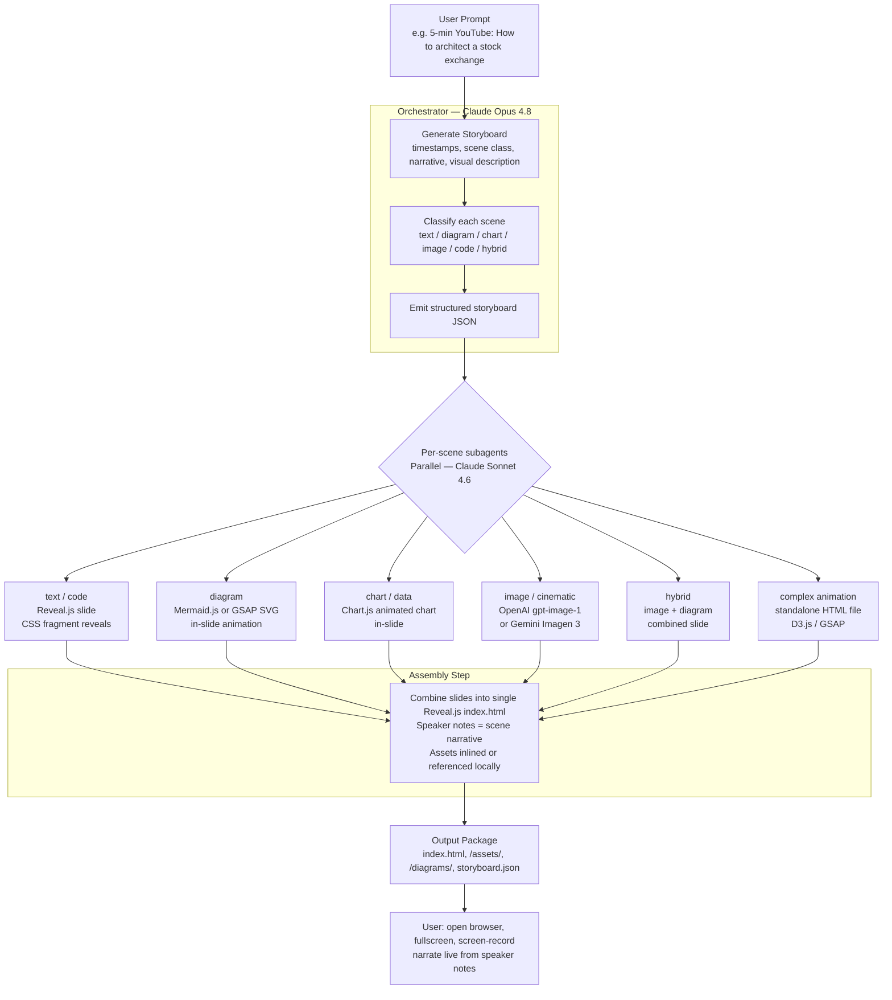
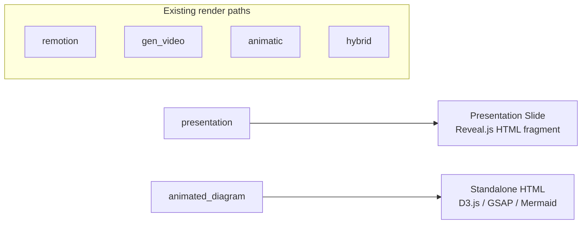
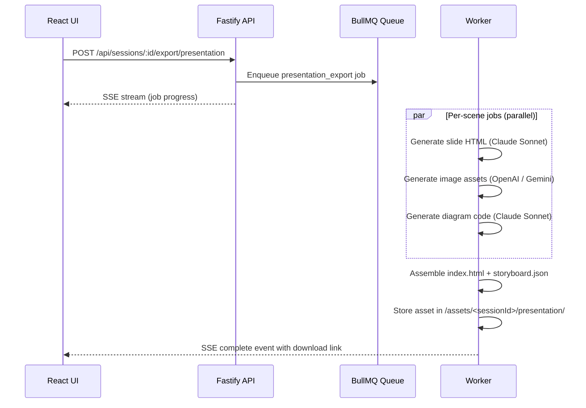
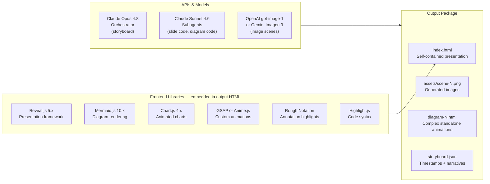

# Presentation Generation Workflow — Research Report

**Date:** 2026-06-27  
**Scope:** Design a workflow that converts a user prompt into animated presentations and animated diagrams suitable for screen-recording into a YouTube video. No actual video or audio generation — user narrates live and screen-records.

---

## 1. Executive Summary

The existing XYZStudio Phase 1 already produces a structured storyboard: timestamped scenes with narrative text and visual descriptions. What is missing is a **render target that outputs a self-contained animated presentation** (not a video) that the user can fullscreen, advance through with a keyboard, and screen-record.

The recommended output format is **Reveal.js HTML** — a browser-based presentation where each scene becomes one slide with CSS animations, animated diagrams, and generated images. The output is a single `index.html` with inlined assets, openable in any browser, and presenter-view-ready.

The generation pipeline runs Claude Sonnet/Opus as the orchestrator, with per-scene Claude Sonnet subagents generating slide code in parallel, and OpenAI `gpt-image-1` or Gemini Imagen for image assets where needed.

---

## 2. Goals and Non-Goals

| In scope | Out of scope |
|---|---|
| Animated HTML presentations (Reveal.js) | Video file generation (mp4, webm) |
| Animated diagrams embedded in slides | TTS/voice-over generation |
| Standalone animated diagram HTML files for complex scenes | ElevenLabs integration (user narrates live) |
| Image generation for illustration/background scenes | Platform upload or metadata packaging |
| Per-scene speaker notes (narrative text) | Subtitle/caption embedding |
| Parallel per-scene generation via subagents | Assembly into a final video |

---

## 3. End-to-End Workflow



---

## 4. Scene Classification → Output Format Mapping

| Scene class (existing schema) | Presentation output | Animation mechanism | Asset generation | Complexity tier |
|---|---|---|---|---|
| `text` | Reveal.js slide with title + bullet fragments | CSS fragment reveals, animate.css entrance | None | Simple |
| `diagram` | Mermaid.js rendered inline | Mermaid auto-renders to SVG | None | Simple |
| `chart` | Chart.js canvas inside slide | Chart.js built-in enter animation (scale/fade) | None | Simple |
| `character` / `cinematic` | Full-bleed image slide with text overlay | Ken Burns CSS pan-zoom on image | `gpt-image-1` or Gemini Imagen | Simple |
| `code` | Reveal.js slide with highlight.js + fragment reveals | Line-by-line highlight steps | None | Simple |
| `hybrid` | Image background + overlaid diagram or chart | Combined: image + Mermaid/Chart.js layer | `gpt-image-1` or Gemini Imagen | Medium |
| `diagram` (animated) | GSAP SVG stroke-draw or D3.js animated graph | GSAP timeline or D3 enter/update/exit | None | Medium |
| `chart` (step-by-step) | D3.js animated bar/line with progressive reveal | D3 transitions, scrubable via slide fragments | None | Medium |
| Any class — user opts in | Standalone `diagram-N.html` linked from slide | GSAP / D3 bespoke timeline, algorithm walkthroughs | Possibly image | **Complex (opt-in)** |

**Complexity tiers in practice:**
- **Simple + Medium** are generated automatically for every scene. The LLM picks the right output type based on `sceneClass` + `visualDescription`.
- **Complex** is unlocked per scene via a user toggle ("Make this an animated diagram") on the scene editing UI. It produces a standalone `diagram-N.html` file (see §Q5 decision) rather than an in-slide animation.

A `presentationSlideType` field in the scene schema guides which path is taken. The LLM classifies this during storyboard generation; the user can override it.

---

## 5. Tool & API Inventory

### 5.1 Orchestration and Code Generation — LLM

| Task | Model | Rationale |
|---|---|---|
| Storyboard generation (prompt → all scenes) | `claude-opus-4-8` | Highest narrative quality, pacing, humor. Structured output via Zod. |
| Per-scene slide HTML generation | `claude-sonnet-4-6` | Fast, cost-effective for code generation; one per scene in parallel. |
| Mermaid.js diagram code | `claude-sonnet-4-6` | Straightforward code task. |
| Chart.js config JSON | `claude-sonnet-4-6` | Deterministic structured output. |
| D3.js / GSAP animation code (complex scenes) | `claude-sonnet-4-6` with `effort: "high"` | More reasoning needed for generative animation. |
| Speaker notes / narrative cleanup | `claude-sonnet-4-6` | Refines narration to a readable "read aloud" format. |

All via `@anthropic-ai/sdk`, streaming to SSE for the existing UI, structured outputs via `zodOutputFormat`.

### 5.2 Image Generation

Used only for `character`, `cinematic`, and `hybrid` scene classes to generate background images, illustrations, and visual reference art.

**Default provider: OpenAI `gpt-image-1`.** Google Gemini Imagen tiers are user-selectable as an alternative. Both sit behind the existing `ImageProvider` interface in `packages/shared/src/providers/types.ts`.

#### OpenAI (default)

| Model | Quality | Cost est. | When to use |
|---|---|---|---|
| `gpt-image-1` | Standard (1024×1024) | ~$0.04/image | Default for all image scenes |
| `gpt-image-1` | HD (1024×1024) | ~$0.08/image | Hero images, title / final scene |

#### Google Gemini Imagen (user-selectable)

Google Gemini exposes three image generation tiers. User selects one per session; names below follow the Gemini API as of mid-2026 — **verify exact model IDs at implementation time** since Google's naming evolves quickly.

| Tier | Gemini model | Cost est. | Characteristics |
|---|---|---|---|
| **Nano** | `imagen-3.0-fast-generate-001` | ~$0.01–0.02/image | Fastest, cheapest; good for draft/sketch quality |
| **Flash / Standard** | `imagen-3.0-generate-001` | ~$0.03–0.04/image | Balanced quality and cost |
| **Pro** | `imagen-3.0-pro-generate-001` *(verify)* | ~$0.06–0.10/image | Highest quality; use for key visual scenes |

The session creation UI exposes an "Image provider" picker: `OpenAI (default)` / `Gemini Nano` / `Gemini Flash` / `Gemini Pro`. Selected tier is stored on the session row and injected into every image generation job for that session.

### 5.3 Presentation Framework

**Recommendation: Reveal.js**

Rationale over alternatives:

| Framework | Pros | Cons | Verdict |
|---|---|---|---|
| **Reveal.js** | Pure HTML output, zero build step, CSS animations, speaker notes, presenter view, Mermaid plugin, PDF export | Verbose HTML for complex slides | **Primary choice** |
| Slidev | Markdown-driven, Vue components, nice code animations | Requires Node.js serve step, Vue knowledge | Good for developer audience, not self-contained |
| Marp | Simplest markdown → slides | Minimal animation, PDF-first, not interactive | Too simple for this use case |
| Google Slides via API | Familiar, easy sharing | No meaningful CSS animations, API rate limits, no offline use | Ruled out |
| PowerPoint via `python-pptx` | Familiar | Terrible animation support, requires Office | Ruled out |

**Theme picker:** Users select a Reveal.js base theme per session at creation time. Available options and their character:

| Theme | Character | Good for |
|---|---|---|
| `white` | Clean white background, dark text | Tech / flat illustration style (pairs best with default style prompt) |
| `black` | Dark background, light text | Dark-mode / cinematic feel |
| `moon` | Dark blue-grey, serif headings | Professional / editorial |
| `night` | Near-black, cyan accents | Developer / terminal aesthetic |
| `sky` | Light blue gradient | Casual / friendly |
| `beige` | Warm cream | Educational / approachable |
| `simple` | Minimal white, no decoration | Content-first, no distraction |

The selected theme is stored as `revealTheme TEXT` on the session row. The style prompt CSS block (§6) is injected after the theme to override its palette — so the theme controls structure/spacing, the style prompt controls colors/fonts.

Reveal.js features used:
- `data-auto-animate` — smooth morphing between slide states (great for diagrams building step by step)
- `class="fragment"` — bullet points and diagram elements revealed on click/spacebar
- `<aside class="notes">` — speaker notes panel in presenter view (`S` key opens it)
- `RevealMermaid` plugin — renders Mermaid code blocks inline with `mermaid` class
- `RevealHighlight` plugin — syntax-highlighted code with step reveals
- CSS animations (`animate.css` or custom) — entrance animations per slide

A generated presentation looks like:

```html
<!DOCTYPE html>
<html>
<head>
  <link rel="stylesheet" href="https://cdn.jsdelivr.net/npm/reveal.js/dist/reveal.css">
  <link rel="stylesheet" href="https://cdn.jsdelivr.net/npm/reveal.js/dist/theme/black.css">
</head>
<body>
  <div class="reveal"><div class="slides">

    <!-- Scene 0 — 0:00–0:30 — text scene -->
    <section data-auto-animate>
      <h2>How Does a Stock Exchange Work?</h2>
      <p class="fragment">A marketplace where buyers meet sellers</p>
      <p class="fragment">Prices set by real-time supply and demand</p>
      <aside class="notes">
        Welcome everyone. Today we're going to explore...
      </aside>
    </section>

    <!-- Scene 1 — 0:30–1:15 — diagram scene -->
    <section>
      <h3>Order Matching Engine</h3>
      <div class="mermaid">
        sequenceDiagram
          Buyer->>Exchange: Place buy order $100
          Seller->>Exchange: Place sell order $100
          Exchange->>Buyer: Order matched!
          Exchange->>Seller: Order matched!
      </div>
      <aside class="notes">
        The heart of any exchange is the matching engine...
      </aside>
    </section>

  </div></div>
  <script src="https://cdn.jsdelivr.net/npm/reveal.js/dist/reveal.js"></script>
  <script src="https://cdn.jsdelivr.net/npm/reveal.js-mermaid-plugin/plugin/mermaid/mermaid.js"></script>
  <script>Reveal.initialize({ plugins: [RevealMermaid] });</script>
</body>
</html>
```

### 5.4 Animated Diagram Libraries

| Library | Best for | Integration | Learning curve |
|---|---|---|---|
| **Mermaid.js** | Flow charts, sequence diagrams, ER, git graphs, state diagrams | Native Reveal.js plugin; code block → SVG | Low — declarative syntax |
| **Chart.js** | Bar, line, pie, radar, scatter with animated enters | `<canvas>` inside slide | Low — JSON config |
| **D3.js v7** | Custom data-driven animations, network graphs, treemaps | Raw HTML/JS injected into slide or standalone | High |
| **GSAP (GreenSock)** | Professional UI animations — elements flying, drawing, morphing | JS in slide `<script>` or standalone | Medium |
| **Rough Notation** | Hand-drawn annotation highlights (circles, underlines, boxes) | Single script tag | Very low — great for emphasis |
| **Anime.js** | CSS property + SVG animations, simple API | Script tag | Low-medium |

**Recommended combination for most videos:**
- Mermaid.js for structural diagrams (architecture, flow, sequence)
- Chart.js for data charts
- Rough Notation for emphasis/annotation overlays
- GSAP only when the scene description requires bespoke motion

For complex scenes that need their own animation timeline (e.g., "show a bubble sort step by step"), generate a **standalone `diagram-N.html`** and link from the main slide.

---

## 6. Style Prompt

The style prompt drives **both** image generation and slide visual design (Reveal.js CSS overrides), keeping the two consistent within a session.

**Default style prompt** (pre-filled, user can override at session creation):
```
flat vector illustration, tech aesthetic, blue and white color palette,
clean lines, minimal shading, no text, no watermarks
```

The style prompt is stored as `presentationStylePrompt TEXT` on the session row. Users type a freeform override at creation (e.g., `"hand-drawn whiteboard sketch, black marker on white, no color"`).

### Two uses of the style prompt

**1. Image generation** — prepended to every `gpt-image-1` / Gemini Imagen call for the session (see §8.3).

**2. Slide CSS generation** — after the storyboard is generated, a single Claude Sonnet call reads `presentationStylePrompt` and produces a small `<style>` block that overrides Reveal.js theme variables:

```
Given this style description: "[presentationStylePrompt]"
Output a CSS block that overrides Reveal.js CSS variables for:
--r-background-color, --r-main-color, --r-heading-color, --r-link-color,
--r-main-font, --r-heading-font.
Keep it under 20 lines. Output only valid CSS, no prose.
```

The generated `<style>` block is injected into `index.html` after the theme stylesheet, so it overrides the chosen Reveal.js base theme without touching library files. This means the base theme controls layout/structure while the style prompt controls palette and typography.

This is intentionally simpler than the full "style bible" used in Video mode — no character sheets, just a consistent prompt string + CSS block.

---

## 7. Integration with Existing XYZStudio Architecture

**Presentation mode is a separate session type (Option A).** Users choose at session creation: "Presentation" or "Video". The two paths are independent — a Presentation session skips the budget slider, voice selection, and all video/TTS pipeline machinery. It gets its own lighter session creation form.

The existing architecture needs one new render path added alongside the existing ones.

### 7.1 New render path: `presentation`



Add to `RenderPath` enum in `packages/shared/src/schemas/transcript.ts`:
```ts
export const RenderPath = z.enum([
  "remotion", "gen_video", "animatic", "hybrid",
  "presentation",       // new — Reveal.js slide HTML
  "animated_diagram",   // new — standalone HTML animation file
]);
```

### 7.2 New worker route: `POST /api/sessions/:id/export/presentation`

This route triggers a BullMQ job chain:



### 7.3 Output structure stored in the asset system

```
data/users/<userId>/sessions/<sessionId>/presentation/
├── index.html              ← self-contained Reveal.js presentation
├── storyboard.json         ← scenes with timestamps + narrative (for reference)
└── assets/
    ├── scene-2-bg.png      ← generated image for scene 2
    ├── scene-5-bg.png      ← generated image for scene 5
    └── diagram-4.html      ← standalone animated diagram for scene 4
```

**Output delivery (Option C — both):** The XYZStudio UI renders the finished `index.html` in an iframe preview panel so the user can verify it without leaving the app. A "Download as zip" button packages `index.html` + `assets/` + `diagrams/` into a single zip file. The zip uses **CDN links** for Reveal.js and diagram libraries (small zip size; requires internet to open, which is standard for screen-recording sessions). Both are served via the existing `GET /api/assets/:assetId` route; the zip is assembled on demand by a lightweight server-side zip stream.

**Standalone diagram slides (Complex scenes):** When a scene has a standalone `diagram-N.html`, the corresponding slide in `index.html` is a **placeholder** — it shows the scene title, a one-line description, and a clearly visible link ("Open animated diagram →" pointing to `diagrams/diagram-N.html`). The user opens that file in a separate browser tab, records it independently, and splices it into the final video during editing. No iframe embedding.

---

## 8. Prompt Engineering Strategy

### 8.1 Storyboard generation prompt additions

The existing transcript generation prompt needs two additions for presentation mode:

1. **`presentationSlideType`** field on each scene (in addition to `sceneClass`):
   - `"title"` — large title, optional subtitle, minimal animation
   - `"bullets"` — fragment-revealed bullet points
   - `"diagram"` — Mermaid code or instruction for diagram
   - `"chart"` — data + chart type + Chart.js config
   - `"image"` — full-bleed generated image with text overlay
   - `"code"` — code snippet with step-by-step highlights
   - `"split"` — two-column: text left, image/diagram right
   - `"timeline"` — horizontal or vertical progression

2. **`mermaidCode`** or **`chartConfig`** field (optional): if the LLM can directly emit the diagram code during storyboard generation, do it; otherwise the per-scene subagent generates it from `visualDescription`.

### 8.2 Per-scene slide generation prompt

Each per-scene subagent (Claude Sonnet) receives:
- Scene index, timestamps
- Narrative text (→ speaker notes)
- `sceneClass` + `presentationSlideType`
- `visualDescription` (→ slide visual content)
- Session style (cartoon vs. whiteboard vs. minimal clean)
- Any previously generated character/style reference (for image prompts)
- Instructions: output a single `<section>…</section>` Reveal.js HTML fragment

### 8.3 Prompt for image generation

For `character` / `cinematic` / `image` scenes, the subagent first generates an image prompt for OpenAI/Gemini, then calls the image API:

```
Generate an image for a YouTube presentation slide.
Style: [session.presentationStylePrompt]
Scene: [visualDescription]
Aspect ratio: 16:9 landscape
Do NOT include text, watermarks, or UI elements.
```

`session.presentationStylePrompt` defaults to:
```
flat vector illustration, tech aesthetic, blue and white color palette,
clean lines, minimal shading, no text, no watermarks
```

---

## 9. Cost Model for Presentation Mode

Presentation mode is dramatically cheaper than video mode because:
- No video generation API calls
- No TTS calls
- Image generation only for visual/cinematic scenes (not all scenes)

Rough estimates per 5-minute video (~10 scenes):

| Step | Model / API | Estimated cost |
|---|---|---|
| Storyboard generation | Claude Opus 4.8 (~5K output tokens) | ~$0.13 |
| 10× slide HTML generation | Claude Sonnet 4.6 (~800 tokens/slide × 10) | ~$0.04 |
| 3× image generation (non-diagram scenes) | OpenAI gpt-image-1 standard | ~$0.12 |
| Total | — | **~$0.30 per 5-min video** |

Compare to existing gen-video path: ~$10–50+ per 5-min video.

---

## 10. Implementation Roadmap

Presentation mode is a **separate session type** and a new Phase 2 track independent of the existing video pipeline.

### Step 1: Session schema (low effort)
- Add `sessionType: "video" | "presentation"` to `video_sessions` table
- Add `presentationStylePrompt TEXT` (default: flat vector illustration prompt) to `video_sessions`
- Add `revealTheme TEXT` (default: `"white"`) to `video_sessions`
- Add `imageProvider: "openai" | "gemini-nano" | "gemini-flash" | "gemini-pro"` to `video_sessions`
- Add `presentationSlideType` to `Scene` schema (optional field, backward-compatible)
- Add `presentation` and `animated_diagram` to `RenderPath` enum

### Step 2: Session creation UI (low effort)
- Add session type selector ("Video" / "Presentation") at creation
- Presentation sessions: hide budget slider + voice picker; show:
  - Style prompt textarea (pre-filled with default)
  - Reveal.js theme picker (dropdown, 7 options with brief descriptions)
  - Image provider picker (OpenAI default / Gemini Nano / Flash / Pro)
- All three stored on session row

### Step 3: Transcript prompt update (low effort)
- Extend the Claude storyboard generation prompt to emit `presentationSlideType` per scene
- Add optional `diagramCode` field (Mermaid/Chart.js) for diagram/chart scenes so the LLM can emit it directly during storyboard generation

### Step 4: Per-scene slide generator (medium effort)
- New worker function: `generateSlideHtml(scene, session) → string` (calls Claude Sonnet)
- New image prompt builder: `buildImagePrompt(scene, session.presentationStylePrompt) → string`
- Calls existing `ImageProvider` adapter, selecting provider based on `session.imageProvider`
- For scenes with user-toggled Complex flag: calls `generateDiagramHtml(scene, session) → string` (produces standalone `diagram-N.html` via Claude Sonnet with `effort: "high"`)

### Step 5: Presentation assembler (medium effort)
- New function: `assemblePresentation(slides, sessionMeta) → string` (produces Reveal.js HTML)
- Embeds CDN links for Reveal.js 5.x, RevealMermaid plugin, Chart.js, Highlight.js (CDN; zip is internet-dependent by design)
- Injects selected `revealTheme` stylesheet link
- Injects Claude-generated CSS override block derived from `presentationStylePrompt` (single Sonnet call, ~200 tokens)
- Speaker notes (`<aside class="notes">`) populated from scene `narration` field
- Complex scenes rendered as placeholder slides with "Open animated diagram →" link to `diagrams/diagram-N.html`
- Writes `storyboard.json` alongside
- Saves to storage under `presentation/`, inserts asset row

### Step 6: New API route + BullMQ job (medium effort)
- `POST /api/sessions/:id/export/presentation` → enqueues `presentation_export` job, streams progress via SSE
- Worker picks up job, runs per-scene generators in parallel (Step 4), then assembles (Step 5)

### Step 7: Output delivery UI (low effort)
- In-app iframe preview panel showing the generated `index.html`
- "Download as zip" button — server assembles zip stream of `index.html` + `assets/` + `diagrams/`
- Scene-level "Make animated diagram" toggle on the scene editing UI to opt into Complex generation

---

## 11. Presentation Viewer UX for Screen Recording

Once the user downloads or opens the `index.html`:

| Action | Key |
|---|---|
| Next fragment / slide | `Space` or `→` |
| Previous | `←` |
| Open presenter view (notes + timer) | `S` |
| Fullscreen | `F` |
| Overview mode | `O` |
| Export to PDF | `?` → "PDF Export" or append `?print-pdf` to URL |

For screen recording:
1. Open `index.html` in Chrome/Firefox
2. Press `F` for fullscreen
3. Start screen recording (OBS, QuickTime, Loom)
4. Press `S` in a second window for presenter view (shows speaker notes + timer on secondary screen or side)
5. Advance slides with spacebar, narrate from speaker notes

---

## 12. Full Toolchain Summary



---

## 13. Decision Log

All open questions resolved (2026-06-27).

| # | Question | Decision |
|---|---|---|
| Q1 | Image generation tiers ("nano banana pro") | Google Gemini Imagen tiers (Nano / Flash / Pro) are the three tiers. Users can select per session; **default is OpenAI `gpt-image-1` standard**. Exact Gemini model IDs to be verified at implementation time. |
| Q2 | Presentation framework | **Reveal.js** — single-file HTML, no build step, offline-ready, easiest to screen-record. |
| Q3 | Presentation vs. Video pipeline relationship | **Option A — separate session types.** User chooses at creation. Presentation sessions skip budget slider, voice, and all video pipeline machinery. |
| Q4 | Animation complexity | **Simple + Medium generated automatically.** Complex (bespoke animations, algorithm walkthroughs) is **opt-in per scene** via a UI toggle, producing a standalone `diagram-N.html`. |
| Q5 | Standalone animated diagram format | **Option A — standalone `diagram-N.html`.** Opened separately in a browser, screen-recorded independently, spliced in during video editing. |
| Q6 | Style consistency | **Session-scoped style prompt string** (simpler than full style bible). Default: `"flat vector illustration, tech aesthetic, blue and white color palette, clean lines, minimal shading, no text, no watermarks"`. User can override at session creation. |
| Q7 | Output delivery | **Option C — both.** In-app iframe preview + "Download as zip" button packaging `index.html`, `assets/`, and `diagrams/`. |
| Q8 | Reveal.js theme | **Per-session theme picker** (7 built-in themes). Default: `white`. Stored as `revealTheme` on the session row. Style prompt CSS overrides are injected after the theme to control palette. |
| Q9 | Style prompt scope | **Affects both** image generation prompts and slide visual design (Claude-generated CSS variable overrides injected into `index.html`). |
| Q10 | Zip download — CDN vs. bundled | **CDN links** (small zip; requires internet to open, acceptable for screen-recording sessions). |
| Q11 | Standalone diagram reference in main presentation | **Option A — placeholder slide** with visible "Open animated diagram →" link. User opens in separate tab, records independently, splices during video editing. |
